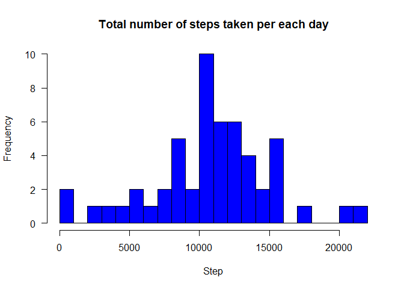
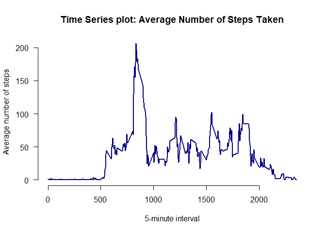
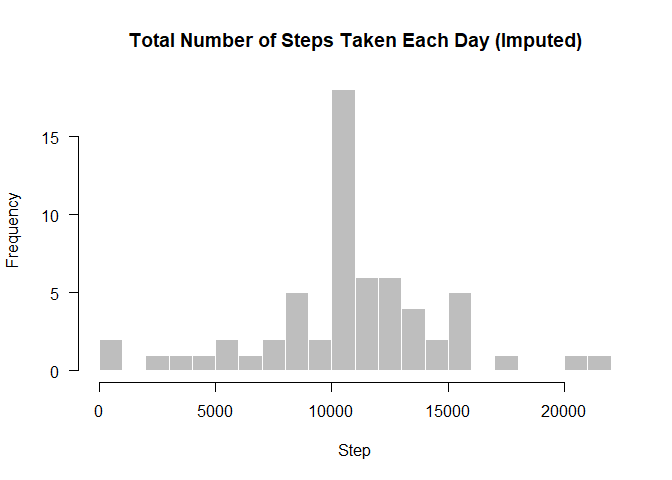
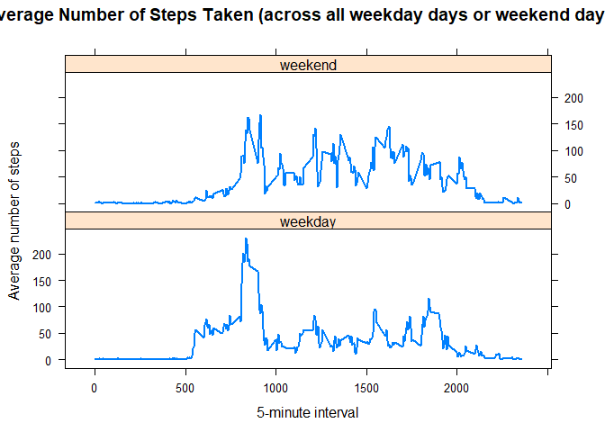

### Nagaraju Aswadhati

```r
date()
```

```
## [1] "Sun Jan 21 00:12:08 2018"
```

## Loading and preprocessing the data

#### Show any code that is needed to
 Load the data (i.e. read.csv()).


```r
knitr::opts_chunk$set(echo = TRUE)
require("knitr")
```

```
## Loading required package: knitr
```

```r
# Set root working directory
opts_knit$set(root.dir = "D:/TechnicalStack/Nag git/RepData_PeerAssessment1")
# load the data
activity_data <- read.csv("activity.csv")
# Descriptive Stats of all the features
summary(activity_data)
```

```
##      steps                date          interval     
##  Min.   :  0.00   2012-10-01:  288   Min.   :   0.0  
##  1st Qu.:  0.00   2012-10-02:  288   1st Qu.: 588.8  
##  Median :  0.00   2012-10-03:  288   Median :1177.5  
##  Mean   : 37.38   2012-10-04:  288   Mean   :1177.5  
##  3rd Qu.: 12.00   2012-10-05:  288   3rd Qu.:1766.2  
##  Max.   :806.00   2012-10-06:  288   Max.   :2355.0  
##  NA's   :2304     (Other)   :15840
```

```r
# check first few rows
head(activity_data)
```

```
##   steps       date interval
## 1    NA 2012-10-01        0
## 2    NA 2012-10-01        5
## 3    NA 2012-10-01       10
## 4    NA 2012-10-01       15
## 5    NA 2012-10-01       20
## 6    NA 2012-10-01       25
```

```r
# Understand the structure of the data
str(activity_data)
```

```
## 'data.frame':	17568 obs. of  3 variables:
##  $ steps   : int  NA NA NA NA NA NA NA NA NA NA ...
##  $ date    : Factor w/ 61 levels "2012-10-01","2012-10-02",..: 1 1 1 1 1 1 1 1 1 1 ...
##  $ interval: int  0 5 10 15 20 25 30 35 40 45 ...
```

* Process/transform the data (if necessary) into a format suitable for your analysis. *

```r
activity_data$date <- as.Date(activity_data$date, format = "%Y-%m-%d")
```

## What is mean total number of steps taken per day?
#####For this part of the assignment, you can ignore the missing values in the dataset.
 Calculate the total number of steps taken per day.


```r
# the total number of steps taken per day
total_steps <- aggregate(steps ~ date, data = activity_data, sum, na.rm = TRUE)
head(total_steps)
```

```
##         date steps
## 1 2012-10-02   126
## 2 2012-10-03 11352
## 3 2012-10-04 12116
## 4 2012-10-05 13294
## 5 2012-10-06 15420
## 6 2012-10-07 11015
```

If you do not understand the difference between a histogram and a barplot, research the difference between them. Make a histogram of the total number of steps taken each day.


```r
hist(total_steps$steps, breaks = 20, 
     main = "Total number of steps taken per each day",
     col = "blue", border = "black", xlab = "Step", axes = FALSE)
axis(1)
axis(2, las = 1)
```

<!-- -->

 Calculate and report the mean and median of the total number of steps taken per day. 


```r
mean(total_steps$steps)
```

```
## [1] 10766.19
```

```r
median(total_steps$steps)
```

```
## [1] 10765
```


## What is the average daily activity pattern?


 Make a time series plot (i.e. type = "l") of the 5-minute interval (x-axis) and the average number of steps taken, averaged across all days (y-axis).


```r
avg_step <- aggregate(steps ~ interval, data = activity_data, mean, na.rm = TRUE)
plot(avg_step$interval, avg_step$steps, type = "l", lwd = 2, col = "navy",
     main = "Time Series plot: Average Number of Steps Taken", axes = FALSE,
     xlab = "5-minute interval", ylab = "Average number of steps")
axis(1)
axis(2, las = 1)
```

<!-- -->


 Which 5-minute interval, on average across all the days in the dataset, contains the maximum number of steps? 


```r
avg_step$interval[which.max(avg_step$steps)]
```

```
## [1] 835
```
#### The 835-th 5-minute interval contains the maximum number of steps.

## Imputing missing values

#### Note that there are a number of days/intervals where there are missing values (coded as NA). The presence of missing days may introduce bias into some calculations or summaries of the data.

* Calculate and report the total number of missing values in the dataset (i.e. the total number of rows with NAs). *


```r
totalna<- sum(is.na(activity_data$steps))
```

#### There are 2304 missing values in the dataset.
Devise a strategy for filling in all of the missing values in the dataset. The strategy does not need to be sophisticated. For example, you could use the mean/median for that day, or the mean for that 5-minute interval, etc.
#### Here I use the mean of 5-minute interval to fill in the values of the missing values.
Create a new dataset that is equal to the original dataset but with the missing data filled in.


```r
activity <- activity_data # new dataset called activity
for (i in avg_step$interval) {
    activity[activity$interval == i & is.na(activity$steps), ]$steps <- 
        avg_step$steps[avg_step$interval == i]
}
sum(is.na(activity)) # no NAs
```

```
## [1] 0
```


* Make a histogram of the total number of steps taken each day and Calculate and report the mean and median total number of steps taken per day. Do these values differ from the estimates from the first part of the assignment? What is the impact of imputing missing data on the estimates of the total daily number of steps?  *


```r
total_step_imp <- aggregate(steps ~ date, data = activity, sum, na.rm = TRUE)
hist(total_step_imp$steps, breaks = 20, 
     main = "Total Number of Steps Taken Each Day (Imputed)",
     col = "grey", border = "white", xlab = "Step", axes = FALSE)
axis(1)
axis(2, las = 1)
```

<!-- -->

```r
mean(total_step_imp$steps)
```

```
## [1] 10766.19
```

```r
median(total_step_imp$steps)
```

```
## [1] 10766.19
```


The mean is the same as the mean from the first part of the assignment, but the median is not, although their values are close. Imputing missing data using the average of the 5-minute interval results in more data points equal to the mean and smaller variation of the distribution. Since many data points have the same values as the mean, the median is much likely to be the same as the mean as well.

## Are there differences in activity patterns between weekdays and weekends?

#### For this part the weekdays() function may be of some help here. Use the dataset with the filled-in missing values for this part.

Create a new factor variable in the dataset with two levels – “weekday” and “weekend” indicating whether a given date is a weekday or weekend day.


```r
activity$day <- weekdays(activity$date)
activity$week <- ""
activity[activity$day == "Saturday" | activity$day == "Sunday", ]$week <- "weekend"
activity[!(activity$day == "Saturday" | activity$day == "Sunday"), ]$week <- "weekday"
activity$week <- factor(activity$week)
```

Make a panel plot containing a time series plot (i.e. type = “l”) of the 5-minute interval (x-axis) and the average number of steps taken, averaged across all weekday days or weekend days (y-axis).


```r
avg_step_imp <- aggregate(steps ~ interval + week, data = activity, mean)
library(lattice)
xyplot(steps ~ interval | week, data = avg_step_imp, type = "l", lwd = 2,
       layout = c(1, 2), 
       xlab = "5-minute interval", 
       ylab = "Average number of steps",
       main = "Average Number of Steps Taken (across all weekday days or weekend days)")
```

<!-- -->
